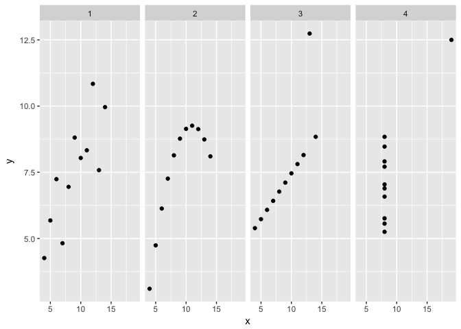
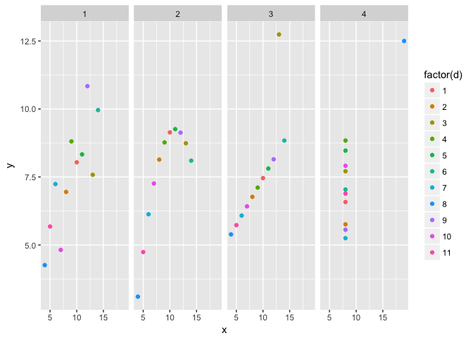
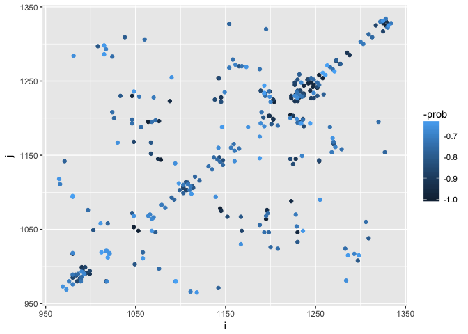

Workshop on Data Visualization
================
R Tyler McLaughlin
2017-05-20

**NOTE: this is just a preview of the full documentation. If you wish to view the interactive plots, please navigate to <https://rtylermclaughlin.shinyapps.io/shinyMarkdown/>. GitHub can't render interactive plots (shiny,Rbokeh) within a markdown (.md) file. For full documentation (while hosting lasts), please navigate to <https://rtylermclaughlin.shinyapps.io/shinyMarkdown/>**

Motivation for data visualization
=================================

Anscombe's quartet is a terrific example of the importance of plotting data points rather than reporting average values in bar chart format.
Load necessary packages for plotting and manipulating data:

``` r
# hashtags indicate comments.
# I.e., this line is not executable R code but a comment.
# load ggplot2 and data.table packages  
library("ggplot2")
library("data.table")
source('./code/dataVizUtil/R/functions.R')
```

Import the data set into a data.table:

``` r
anscombe <- data.table(read.csv('./data/anscombe.csv'))
```

What does this numerical data look like? Use this command to view the "head" of the data.table.

``` r
head(anscombe)
```

    ##    X d set  x    y
    ## 1: 1 1   1 10 8.04
    ## 2: 2 1   2 10 9.14
    ## 3: 3 1   3 10 7.46
    ## 4: 4 1   4  8 6.58
    ## 5: 5 2   1  8 6.95
    ## 6: 6 2   2  8 8.14

By plotting, you see that there are four, quite different data sets.
We can plot by running the following ggplot command.

``` r
# aes stands for a e s t h e t i c s.  This is a very important function!
# it tells ggplot what to plot and how to map it 
# to the geom_point() function.
# notice the ~ notation. 
ggplot(anscombe,aes(x=x,y=y) ) + geom_point() + facet_grid(~set)
```



We can use the "color" argument of aes() assist visualization of complex data. Here, it's simply coloring by the number assigned to each data point. This makes it easier to see that each set in the quartet has 11 data points.

``` r
# color by the data point's number !     
ggplot(anscombe,aes(x = x,y = y,color = factor(d)) ) + geom_point() + facet_grid(~set)
```



See what happens if you remove the `geom_point()` or `facet_grid()` terms.

Ok, We have four data sets with 11 data points each, yet they appear different qualitatively. How about the statistics?

<!-- ```{r} -->
<!-- #  add a linear fit.  "lm"  means "linear model"     -->
<!-- ggplot(anscombe,aes(x=x,y=y) ) + geom_point(aes(color = factor(d))) + geom_smooth(method = "lm") +  facet_grid(~set) -->
<!-- ``` -->
Let's manipulate data.tables, using their so-called "\[i, j, by\]" notation (this is derived from SQL). "i" refers to operations on rows and "j" refers to operations on columns. "by" means calculate "j" grouping by "by"

``` r
# .() means "as data.table"
# Stylistically, R often uses periods as spaces.
# Let's define new variables "my.Average.X" and "my.Average.Y"
anscombe[,.(my.Average.X = mean(x),my.Average.Y = mean(y)), by = "set"  ]
```

    ##    set my.Average.X my.Average.Y
    ## 1:   1            9     7.500909
    ## 2:   2            9     7.500909
    ## 3:   3            9     7.500000
    ## 4:   4            9     7.500909

That yielded the mean for x, which is the same for all sets. The same is also true for the mean for y. This is *not* a bug! Four distinct data sets look very different yet they are exactly the same **on average**.
This is part of what is special about Anscombe's quartet.

How about their standard deviation?

``` r
# The function 'sd' also does exactly what you'd expect
anscombe[,.(my.SD.X = sd(x),my.SD.Y = sd(y)), by = "set"  ]
```

    ##    set  my.SD.X  my.SD.Y
    ## 1:   1 3.316625 2.031568
    ## 2:   2 3.316625 2.031657
    ## 3:   3 3.316625 2.030424
    ## 4:   4 3.316625 2.030579

For nicer notation, you can also write:

``` r
anscombe[,.(my.SD.X = sd(x),my.SD.Y = sd(y)), .(set)  ]
```

Before we move on to another data set, let's compute the Pearson Product-Moment Correlation Coefficient (Pearson's r):

``` r
# the function cor()
anscombe[,.(my.XY.correlation = cor(x,y)), .(set)]
```

    ##    set my.XY.correlation
    ## 1:   1         0.8164205
    ## 2:   2         0.8162365
    ## 3:   3         0.8162867
    ## 4:   4         0.8165214

A Second Example
================

This example teaches several tricks for visualizing data that is more complex than Anscombe's quartet. This data set has a broad range of discrete variables (a pairwise contact map in protein sequence space) and associated continous variables.

The data set was generated with the *Gremlin* tool (<http://gremlin.bakerlab.org>) to predict 3D protein contacts from sequence data alone.
First *Gremlin* searches a protein database and collects homologous protein sequences from many organisms and computes a multiple sequence alignment.
It next uses an information-theoretical algorithm to tabulate how pairs of residues covary across homologs.
Residues with a strong tendency to co-evolve have a high probability of forming a contact in 3-dimensions.
Cool, right? Let's get on to visualizing.

Import your data again by first reading a file then converting it to the ***data.table*** format. This time, we're reading a .txt file, so we can use the function 'read.table'

``` r
dt.grd <- data.table(read.table('./data/gremlinContacts_962-1345.txt',header = TRUE))
head(dt.grd)
```

    ##      i   j  i_id  j_id  r_sco s_sco  prob
    ## 1: 280 291 280_F 291_N 0.1280 3.212 1.000
    ## 2: 103 234 103_G 234_Y 0.1145 2.872 1.000
    ## 3:  87  92  87_N  92_K 0.0907 2.275 0.998
    ## 4: 117 183 117_E 183_K 0.0894 2.243 0.998
    ## 5: 243 261 243_D 261_R 0.0872 2.189 0.997
    ## 6: 267 271 267_I 271_L 0.0760 1.906 0.989

data.tables in R make it *very* easy to manipulate data in numerous kinds of ways. Here we are adjusting the numbering scheme of the amino acid residues by adding the integer 961 to all residue numbers . ":=" translates roughly to "add *this* new column with *this* definition" <!-- FIX NAMING, because of the i,j notation-->

``` r
# fix amino acid numbering
dt.grd[,i := i+961]
dt.grd[,j := j+961]
```

`symmetrize()` is a custom function I built, which adds the mirror image of data along the x = y axis. Functions are called like this:

``` r
dt.grd.sym <- symmetrize(dt.grd)
```

Since this is a custom function, you can see what the function does by examining the code:

``` r
symmetrize
```

    ## function (your.dt) 
    ## {
    ##     inverted.dt <- copy(your.dt)
    ##     inverted.dt[, `:=`(c("j", "i"), .(i, j))]
    ##     inverted.dt[, `:=`(c("j_id", "i_id"), .(i_id, j_id))]
    ##     combined.dt <- rbind(your.dt, inverted.dt)
    ##     combined.dt <- combined.dt[order(-prob)]
    ## }

Many of these lines of code are data.table operations. This is an example of "*data munging*": that is, reshaping the organization of the data without changing the relationships in the data. Munging is a routine task in data analysis and data.tables is the best tool I've found for making this more tractable.

Let's try plotting this data with ggplot().

To avoid overplotting, let's filter the data, and plot the first 300 data points. We are filtering rows, so let's do this in data.table "i". We don't need to write commas if we are just specifying "i".

``` r
last.value <- 300
dt.filtered <- dt.grd.sym[1:last.value]
nrow(dt.filtered)
```

    ## [1] 300

``` r
# Note that in many cases, we can also put the 
# aes() function inside the geom_point()
ggplot(dt.filtered) + geom_point(aes(x = i,y = j,colour = -prob)) 
```



This looks OK, but we can do a lot better. Recall that the figure axes are amino acid numbers. We may want to know the exact residue number, and that is not determinable by eye.

Let's try another package called "Rbokeh" and plot again. With the "hover" argument, it can report properties of the data point when you hover over it with your mouse. The "size" argument changes the size of the data points based on one of its associated values.

``` r
# load Rbokeh
library(rbokeh)
# ly_points function is like the geom_point function.
# we now have a "hover" argument that we can use.
ly_points(figure(),i,j,data = dt.filtered,size = 13*prob, hover = list(i,j))
```

    ## [1] "Rbokeh plots cannot be rendered on github markdown.  To see this plot, please navigate to https://rtylermclaughlin.shinyapps.io/shinyMarkdown/"

The `size`, `hover`, and `color` arguments are great ways of visualizing relatively **high-dimensional data**.

We can color with a **ramp**, aka color gradient, where we generate all the hues between two colors.

Let's first find out how many data points we have...

``` r
nrow(dt.filtered)
```

    ## [1] 300

Recall that we already defined a variable with this value, named `last.value`. It's good programming practice to frequently test that the variables we think are equal are *in fact* equal.  

``` r
# check to make sure 'last.value' 
# equals the number of data points, as expected.
#  '==' will always return TRUE or FALSE.  
last.value == nrow(dt.filtered)
```

    ## [1] TRUE

Next let's make a ramp with 300 colors.

``` r
ramp <- colorRampPalette(c("red", "blue"))(last.value)
length(ramp)
```

    ## [1] 300

``` r
# show the first 20 points of ramp
head(ramp,20)
```

    ##  [1] "#FF0000" "#FE0000" "#FD0001" "#FC0002" "#FB0003" "#FA0004" "#F90005"
    ##  [8] "#F90005" "#F80006" "#F70007" "#F60008" "#F50009" "#F4000A" "#F3000B"
    ## [15] "#F3000B" "#F2000C" "#F1000D" "#F0000E" "#EF000F" "#EE0010"

Great. Next, we'll color using our ramp.

We can also use the **pipe** syntax '%&gt;%' from the *magrittr* package to make the code more readable. This lets us pull the function `figure()` outside of the function `ly_points()` and place it upstream,
improving readability without damaging the results.

Pipes are useful when we have functions of functions of functions...

``` r
# illustrates piping and coloring by a ramp.
figure() %>%
  ly_points(i, j, data = dt.filtered,
            color = ramp, size = 13*prob,
            hover = list(i, j)) %>%
      x_range(c(957,1350)) %>%
      y_range(c(1350,957)) %>%
      x_axis(label = "amino acid j") %>%
      y_axis(label = "amino acid i")
```

    ## [1] "Rbokeh plots cannot be rendered on github markdown.  To see this plot, please navigate to https://rtylermclaughlin.shinyapps.io/shinyMarkdown/"

Above, we included axis labels and also flipped the data along the vertical axis by specifying the `x_range()`.

After clicking the mouse icon, try zooming in and out of the RBokeh plot with your mouse's scroll wheel.
Notice how the size of the data points adapts to the extent of the zoom, showcasing one of the many benefits of user interactivity. You could never do this on a TI-83 Plus.

colorRampPalette can take multiple colors as arguments. Try typing

``` r
?colorRampPalette()
```

to learn about the color-perceptual benefits of coloring your data this way.

<!-- # Making Highly Interactive Plots -->
This last section will show you how to make plots that plot different things depending on what you tell it. A great way of sharing your data with your collaborators who may not know R. Playing with a shiny app in browser is far easier even if they are familiar with R.

Every shiny app is made with a user interface and and a server file.

Take a standard R plot and wrap it in a `renderPlot()` function. Wrap an Rbokeh plot in a `renderRbokeh()` function.

The `selectInput()` and `sliderInput()` functions create the drop down menus and the slider input widgets that constitute the user interface and send data to the `renderRbokeh()`.

``` r
inputPanel(
  selectInput("color.1", label = "First color:",
              choices = c("red","orange","yellow",
                          "peachpuff","plum"),selected = "red"),
  selectInput("color.2", label = "Second color:",
              choices = c("blue","powderblue","skyblue4",
                          "turquoise2","snow3","steelblue2"),selected = "blue"),
  sliderInput("data.points", label = "Data points for plotting:",
              min = 50, max = 450, step = 25 , value = 300)
)
```

<!-- ```{r echo=FALSE} -->
<!-- renderRbokeh({dt.plot <- dt.grd.sym[1:input$data.points]  -->
<!--     # we need to define these agin so that  -->
<!--     # they are updated when the input changes -->
<!--     n <- nrow(dt.plot) -->
<!--     ramp <- colorRampPalette(c(input$color.1, input$color.2))(n) -->
<!--     p <- figure() %>% -->
<!--       ly_points(i, j, data = dt.plot, -->
<!--                 color = ramp, size = 13*prob, -->
<!--                 hover = list(i, j)) -->
<!--     p %>% -->
<!--       x_range(c(957,1350)) %>% -->
<!--       y_range(c(1350,957)) %>% -->
<!--       x_axis(label = "amino acid j") %>% -->
<!--       y_axis(label = "amino acid i") -->
<!-- }) -->
<!-- ``` -->
<!-- To get the figure to respond to the sliders, we also needed to code the following: -->
``` r
renderRbokeh({dt.plot <- dt.grd.sym[1:input$data.points]
    # we need to define these agin so that
    # they are updated when the input changes
    n <- nrow(dt.plot)
    ramp <- colorRampPalette(c(input$color.1, input$color.2))(n)
    p <- figure() %>%
      ly_points(i, j, data = dt.plot,
                color = ramp, size = 13*prob,
                hover = list(i, j))
    p %>%
      x_range(c(957,1350)) %>%
      y_range(c(1350,957)) %>%
      x_axis(label = "amino acid j") %>%
      y_axis(label = "amino acid i")


})
```

``` r
print(my.error)
```

    ## [1] "Rbokeh plots cannot be rendered on github markdown.  To see this plot, please navigate to https://rtylermclaughlin.shinyapps.io/shinyMarkdown/"

The major way in which the plotting code changed from before is that `colorRampPalette()` now takes two *variables*,`input$color.1` and `input$color.2` instead of fixed *strings*. We are also now filtering the length of the data.table with the parameter `input$data.points`.

Questions? Comments?
==================

send an email to <**rtylermclaughlin@gmail.com*>\*

<!-- ## Embedded Application -->
<!-- It's also possible to embed an entire Shiny application within an R Markdown document using the `shinyAppDir` function. This example embeds a Shiny application located in another directory: -->
<!-- ```{r tabsets, echo=FALSE} -->
<!-- shinyAppDir( -->
<!--   system.file("examples/06_tabsets", package = "shiny"), -->
<!--   options = list( -->
<!--     width = "100%", height = 550 -->
<!--   ) -->
<!-- ) -->
<!-- ``` -->
<!-- Note the use of the `height` parameter to determine how much vertical space the embedded application should occupy. -->
<!-- You can also use the `shinyApp` function to define an application inline rather then in an external directory. -->
<!-- In all of R code chunks above the `echo = FALSE` attribute is used. This is to prevent the R code within the chunk from rendering in the document alongside the Shiny components. -->
